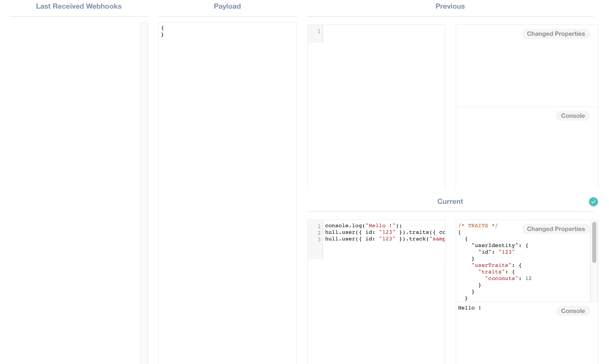
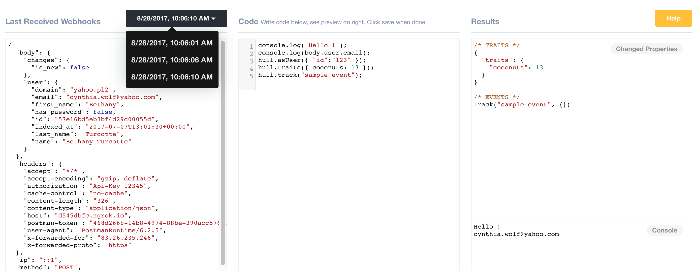
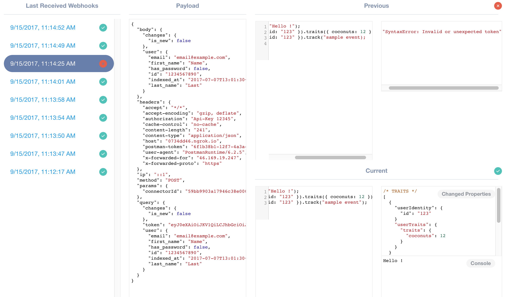

# Incoming Webhooks

The Incoming Webhooks Connector enables you to process Webhooks from external systems and update your user and account data in Hull by writing Javascript.

## Getting Started

Go to the Connectors page of your Hull organization, click the button “Add Connector” and click “Install” on the Incoming Webhooks card. After installation, you will be presented with the Dashboard that displays your unique Webhook Url:


Copy the displayed url and send at least one request to begin writing code.
After you have sent your first request, you will be presented with the three column Dashboard layout. The left column displays the **Request** which is composed of the body, header and other metadata. The center column holds your Javascript **Code** that allows you to transform the request data to the **Output** of the right column. The Output itself displays the changed attributes of the user or account and any associated events.

The request column contains the request you sent from an external system to Hull. The body contains a JSON object of your data but you can also leverage header and other meta information in your code.
You can access the last 100 requests by selecting them from the dropdown list:


The Refresh button allows you to easily reload this list, to check for new requests.

The center column allows you to toggle between the current code and the code at webhook reception, by selecting the appropriate tab:


You can only view the code at webhook reception but are not allowed to make any modifications. To write code make sure to select the tab “Current Code”. Read more about writing code:

- Code Basics
- External libraries
- Golden Rules

## Features

The Incoming Webhooks Connector allows you to receive data from external systems, write Javascript to transform this data and update users and accounts in Hull. Furthermore, you can emit events in Hull to track behavioral data.

This Connector supports to `create users` and `create accounts`. It allows you to `create traits` and `update traits` for both, users and accounts.  In addition, you can `create events` and `link accounts` for users.

To make the Connector even more powerful, you can use the `request` library [https://github.com/request/request](https://github.com/request/request) to call external services.

## Code Basics

You can access the **request data** directly using the following variables:

| Variable Name | Description                                            |
| ------------- | ------------------------------------------------------ |
| `body`        | Contains the parsed data as a `json` object.           |
| `headers`     | Object containing HTTP headers.                        |
| `ip`          | The IP address of the sender.                          |
| `method`      | A string describing the HTTP method.                   |
| `params`      | Object containing the route parameters of the request. |
| `query`       | Object containing the query parameters.                |

Please note that not all variables might contain data depending on the payload sent by the third party system.

Now that you have a good overview of which variables you can access to obtain information, let’s move on to the functions that allow you to **manipulate data**.
You can use the following function call to either **reference an existing user** or **create a new one**.

```javascript
    hull.user({external_id: <value>, email: <value>})
```

It is recommended to use the `external_id` if your payload contains it or rely on the `email` as fallback option. You can pass both identifiers if they are available, but the `external_id` will always take precedence over the `email`. For the purpose of simplicity, the following code will only show the `external_id` identifier.

Lets first explore how you can **change attributes for a user**. There are three different types of attributes, top-level, ungrouped and grouped attributes. ***Top-level and ungrouped attributes*** can be set with the not-overloaded function call

```javascript
    hull.user({external_id: <value>}).traits({ ATTRIBUTE_NAME: <value> })
```

For naming conventions, see the Golden Rules section below.

Of course you can set multiple attributes at once by passing a more complex object like:

```javascript
    hull.user({external_id: <value>}).traits({ ATTRIBUTE_NAME: <value>, ATTRIBUTE2_NAME: <value> })
```

Using this function signature, these attributes are stored in the `traits` attributes group.
If you want to make use of ***grouped attributes***, you can use the overloaded signature of the function, passing the group name as source in the second parameter:

```javascript
    hull.user({external_id: <value>}).traits({ ATTRIBUTE_NAME: <value> }, { source: <group_name> })
```

If you want to “delete” an attribute, you can use the same function calls as described above and simply set `null`  as value.

Now that we know how to handle attributes, let’s have a look at how to **emit events for a user**.
You can use the `hull.track` function to emit events, but before we go into further details be aware of the following:
***You cannot issue more than 10 track calls per received webhook.***

Here is how to use the function signature:

```javascript
    hull.user({external_id: <value>}).track( "<event_name>" , { PROPERTY_NAME: <value>, PROPERTY2_NAME: <value> })
```

The first parameter is a string defining the name of the event while the second parameter is an object that defines the properties of the event.

Now that we know how to deal with users, let’s have a look how to handle accounts.

You can **link an account to the current user** by calling the `hull.account` function with claims that identify the account. Supported claims are `domain`, `id` and `external_id`. To link an account that is identified by the domain, you would write

```javascript
    hull.user({external_id: <value>}).account({ domain: <value> })
```

which would either create the account if it doesn’t exist or link the current user to the existing account.

To **change attributes for an account**, you can use the chained function call `hull.account().traits()`. In contrast to the user, accounts do only support top-level attributes. You can specify the attributes in the same way as for a user by passing an object into the chained `traits` function like

```javascript
    hull.account({domain: <value>}).traits({ ATTRIBUTE_NAME: <value>, ATTRIBUTE2_NAME: <value> })
```

## External Libraries

The Connector exposes several external libraries that can be used:

| Library    | Description
| ---------- | ------------------------------------------------------------------ |
| `_`        | The lodash library. [https://lodash.com/](https://lodash.com/)     |
| `moment()` | The Moment.js library. [https://momentjs.com/](https://momentjs.com/) |
| `urijs()`  | The URI.js library. [https://github.com/medialize/URI.js/](https://github.com/medialize/URI.js/) |
| `request`  | The simplified request client. [https://github.com/request/request](https://github.com/request/request) |

Please visit the linked pages for documentation and further information about these third party libraries.

## Golden Rules

- DO use snake_case rather than camelCase in your naming.
- DO write human readable keys for traits. Don’t use names like `ls` for lead score, just name it `lead_score`.
- DO use `_at` or `_date` as suffix to your trait name to let hull recognize the values as valid dates. You can pass either
  - a valid unix timestamp in seconds or milliseconds or
  - a valid string formatted according to ISO-8601
- DO make sure that you use the proper type for new traits because this cannot be changed later. For example, if you pass `"1234"` as the value for trait `customerId`, the trait will be always a treated as string, even if you intended it to be a number.
- DO NOT write code that generates dynamic keys for traits
- DO NOT use large arrays because they are slowing down the compute performance of your data. Arrays with up to 50 values are okay.

## Debugging and Logging

When operating you might want to log certain information so that it is available for debugging or auditing purposes while other data might be only of interest during development. The processor allows you to do both:

- `console.log` is used for development purposes only and will display the result in the console of the user interface but doesn’t write into the operational logs.
- `console.info` is used to display the result in the console of the user interface and does also write an operational log.

You can access the operational logs via the tab “Logs” in the user interface. The following list explains the various log messages available:

| **Message**                     | **Description**                                                          |
| ------------------------------- | ------------------------------------------------------------------------ |
| `compute.console.log`           | The manually logged information via `console.info`.                      |
| `compute.user.debug`            | Logged when the computation of a user is started.                        |
| `incoming.user`                 | Logs the payload                                                         |
| `incoming.user.success`         | Logged after attributes of a user have been successfully computed.       |
| `incoming.user.skip`            | Logged if the user hasn’t changed and there is no computation necessary. |
| `incoming.account.success`      | Logged after attributes of an account have been successfully computed.   |
| `incoming.account.link.success` | Logged after the user has been successfully linked with an account.      |
| `incoming.account.link.error`   | Logged when an error occurred during linking a user to an account.       |
| `incoming.user.error`           | Logged if an error is encountered during compute.                        |
