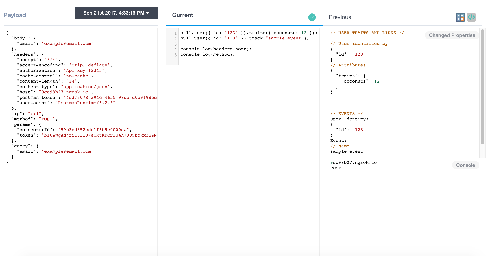
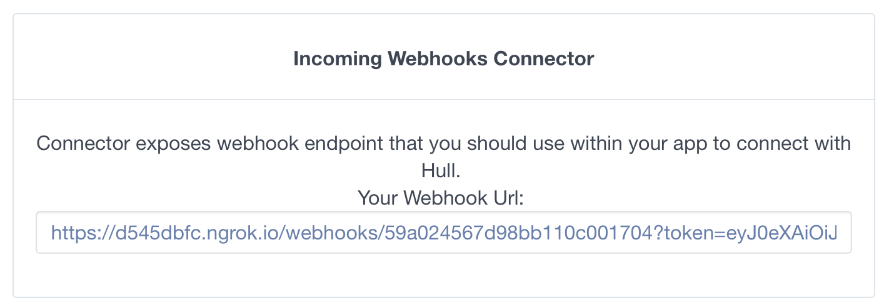
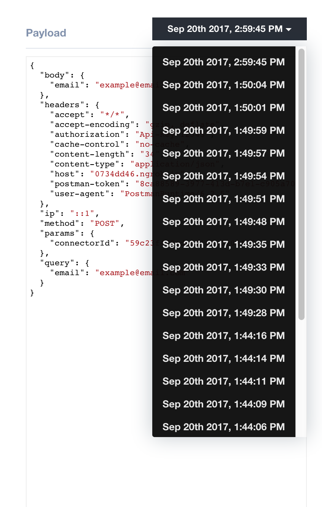

# Incoming Webhooks

This ship lets you process data from incoming webhooks

## Getting Started

Navigate to the 'Connectors' page of your Hull organization, click the button 'Add Connector' and press 'Install' on the Incoming Webhooks card. After successful installation, you will see dashboard of Incoming Webhooks Connector that will look like this:



To send some webhooks you will need to use url that we provide, e.g.:



## Columns

### Left Column
Shows one of last received Webhooks. For every webhook request you have access to : `body`, `headers`, `cookies`, `ip`, `method`, `params`, `query`.

---

### Center Column
Write Javascript code to manipulate data, call `hull.asUser()` to identify user/account in Hull, `hull.track()` to emit events and `hull.traits()` for properties updates.

Example:
```console.log("Hello !");
   hull.asUser({ "id":"123" });
   hull.traits({ coconuts: 12 });
   hull.track("sample event");
```

---

### Right Column
A preview of the updated user, summary of the changes that would be applied and eventual logs and errors from the console.

## Further Instructions

For every incoming webhook we run code that you saved.
So when you're satisfied with code that will be applied to every webhook, click **Save**.

## Features
Incoming Webhooks Connector allows you to update user/account properties with Javascript Code.

##### To succeed you need to identify user with [hull.asUser()](https://github.com/hull/hull-client-node#impersonating-a-user---clientasuser)

##### You can apply [Traits operations](https://github.com/hull/hull-client-node#usertraitsproperties-context)

##### You can emit up to 10 tracking events with [hull.track()](https://github.com/hull/hull-client-node#usertrackevent-props-context)

Checkout `Variables and libraries` section to see what we can give you out of the box.

We are keeping your last ten webhook so you can use them for preview. If you switch to another webhook we will run your code so you can see what changes will be applied.



---

## Variables and libraries

| Function or Variable                  | Description                                                                                                                           |
|---------------------------------------|---------------------------------------------------------------------------------------------------------------------------------------|
| `ship`                                | The Ship's data. Can be used to store additional data                                                                                 |
| `hull.asUser(userIdent)`              | A method to identify user in Hull. Method expects to receive as parameter object with at least one of properties: `email`, `id` which is Hull Id, `external_id` or `anonymous_id`. Method have to be called at least once. Every next invocation will override previous user ident. You cannot update more than one user per webhook. |
| `hull.traits(properties, context)`    | A method to Update User Traits. Optionally define a `context` with a `source` key to save in a custom group.                          |
| `hull.track('Event Name', properties)`| A method to generate new Events for the user. Can be used at most 10 times in a single run of the processor.                          |
| `hull.account(claims)`                | A method to link the Account claimed to this User.                                                                                    |
| `hull.account(claims).traits(properties, context)` | A method to Update Account Traits. If `claims` is defined, the claimed Account will be created/updated and linked to the User, else if `claims` is `null`, the Account belonging to this User will be updated. Optionally define a `context` with a `source` key to save in a custom group. |
| `hull.account(claims).track('Event Name', properties)` | A method to generate new Events for the Account.  If `claims` is defined, the claimed Account will be created/updated and linked to the User, else if `claims` is `null`, the Account belonging to this User will be updated. Can be used at most 10 times in a single run of the processor. |
| `body`                                | Webhook Body                                                                                                                          |
| `headers`                             | Webhook Headers                                                                                                                       |
| `cookies`                             | Webhook Cookies                                                                                                                       |
| `ip`                                  | Webhook Sender's IP Address                                                                                                           |
| `method`                              | Webhook Http Method                                                                                                                   |
| `params`                              | Webhook Params                                                                                                                        |
| `query`                               | Webhook Query                                                                                                                         |
| `moment()`                            | The Moment.js library.                                                                                                                |
| `_`                                   | The lodash library.                                                                                                                   |
| `request(options, callback)`          | The request library. All request will be performed with 3000ms timeout. `options` will be passed to request() method as first argument. See request docs for all available properties. Callback will be invoked with following arguments : `(error, response, body)`. Important note - if you want to see result of this operation you have to use request method with `return` keyword as last line in your code. |
| `console.(log warn error debug)`      | A method to print something to console on dashboard (right bottom corner). All logs for every webhook will be displayed in Connector's logs. Debug logs will be shown only for preview. |

## Limitations & Advantages:

- ES6 is supported.
- You can't use external libraries. You can use all properties that we described in `Variables and libraries` section.
- The only option for asynchronous operation is `request` method described above.
