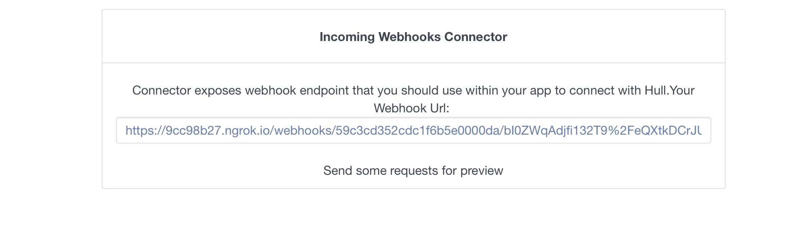
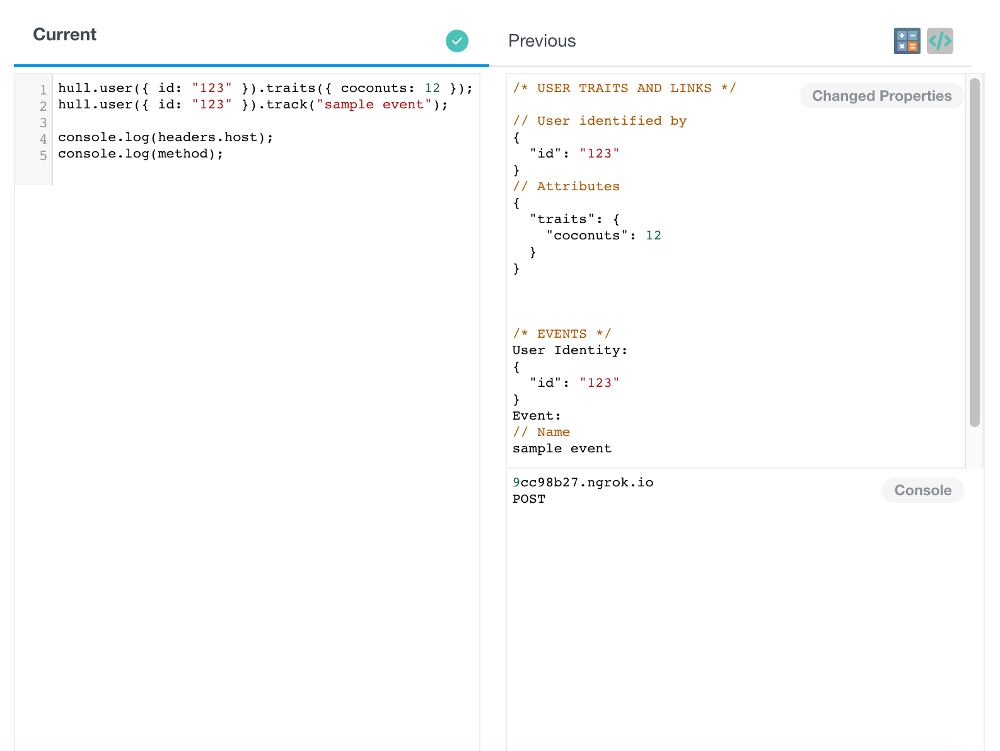

# Incoming Webhooks

This ship lets you process data from incoming webhooks

## Getting Started

Navigate to the 'Connectors' page of your Hull organization, click the button 'Add Connector' and press 'Install' on the Incoming Webhooks card. After successful installation, you will see dashboard of Incoming Webhooks Connector that will look like this:



## Columns

### Payload

Left column displays dropdown with last 100 received webhooks from your application and payload of chosen one.


You can refresh list of last received webhooks by pressing 'refresh' button next to list with last requests.

### Previous/Current Tabs

Right column displays preview of changes that was applied/will be applied to webhook data to update user/account in Hull.

Preview is divided to two sections: 'Previous' and 'Current'.
The Previous section will show you code and changes was applied to your webhook when it arrived to us.
The Current section allows you to write Javascript code on the left and see the preview on the right - what changes will be applied to all incoming webhooks after you save this code.



To sum up - previous section is all about displaying code and changes that was applied to webhook (you can't edit it)
and current section will show you what changes would be applied if you save current code (you can edit the code).

---

In above picture you can see that every webhook has status icon.
Green status indicates that webhook was successfully processed with current code and there was no errors during that.
Red status means that we encountered some errors during processing of your request or we couldn't process it at all for some reason (you can see logs for more details).

---

To send some webhooks you will need to use url that we provided.

If you send some webhooks your UI will look like this:


If you would check you your Webhook Url - we provided you special button for this occasion (pointy brackets icon in right top corner of dashboard).

Also there is a little help pop up if you would like to quickly check connector's capabilities. Just click on calculator icon in right top corner.

## Further Instructions

For every incoming webhook we run code that you saved.
So when you're satisfied with code that will be applied to every webhook, click **Save**.

You can pick webhook to see preview of changes that was applied when it arrived.

## Features
Incoming Webhooks Connector allows you to update user/account properties with Javascript Code.

##### You can apply [Traits operations](https://github.com/hull/hull-client-node#usertraitsproperties-context)

##### You can emit up to 10 tracking events with [track()](https://github.com/hull/hull-client-node#usertrackevent-props-context)

Lets first explore how you can change attributes for a user.
There are three types of attributes, top-level, ungrouped and grouped attributes.
Top-level and ungrouped attributes can be set with the not-overloaded function call `hull.user({USER_IDENTITY_ATTRIBUTE:<value>}).traits({ATTRIBUTE_NAME:<value>})`;
of course you can set multiple attributes at once by passing a more complex object like `hull.user({USER_IDENTITY_ATTRIBUTE:<value>}).traits({ATTRIBUTE_NAME:<value>, ATTRIBUTE2_NAME:<value>})`.
Using this function signature, these attributes are stored in the `traits` attributes group.

If you want to make use of grouped attributes, you can use the overloaded signature of the function, passing the group name as source in the second parameter: `hull.user({USER_IDENTITY_ATTRIBUTE:<value>}).traits({ATTRIBUTE_NAME:<value>}, {source: <group_name>})`.

If you want to “delete” an attribute, you can use the same function calls as described above and simply set `null`  as value.

Now that we know how to handle attributes, let’s have a look at how to emit events for a user.
You can use the `track` function to emit events, but before we go into further details be aware of the following: You cannot use `track` call more than 10 track calls per one webhook.
If you will try to emit more than 10 events, we will take only first 10 events and emit them, the rest will be skipped.

Here is how to use the function signature:
`hull.user({USER_IDENTITY_ATTRIBUTE:<value>}).track(<event_name>, {PROPERTY_NAME:<value>, PROPERTY2_NAME:<value>})`
The first parameter is a string defining the name of the event while the second parameter is an object that defines the properties of the event.

Now that we know how to deal with users, let’s have a look how to handle accounts.

You can link an account to the current user by calling the `hull.account` function with claims that identify the account. Supported claims are `domain`, `id` and `external_id`. To link an account that is identified by the domain, you would write `hull.account({domain: <value>})` which would either create the account if it doesn’t exist or link the current user to the existing account.

To change attributes for an account, you can use the chained function call `hull.account({ACCOUNT_IDENTITY_ATTRIBUTE:<value>}).traits()`.

Also you can link user with account. To do that you can use `hull.user({USER_IDENTITY_ATTRIBUTE:<value>}).account({ACCOUNT_IDENTITY_ATTRIBUTE:<value>})`.
Please remember that only one account can be linked to user so many invocations of above method within same user will end up in last

You can specify the attributes in the same way as for a user by passing an object into the chained `traits` function like `hull.account({ACCOUNT_IDENTITY_ATTRIBUTE:<value>}).traits({ATTRIBUTE_NAME:<value>, ATTRIBUTE2_NAME:<value>})`.

Checkout `Variables and libraries` section to see what we can give you out of the box.

We are keeping your last 100 webhooks so you can use them for preview. If you switch to another webhook we will run your code so you can see what changes will be applied with current code and what changes we applied when previous code was run.

## Example

Below example will print to the console word "Webhook", create trait for user with email 'email@example.com' and emit event for user with id = 1234 (id in Hull).
Note that we used additional options for `hull.user()` method `{ create: false }` which means that if there is no user in Hull with that specific email - we won't create it.

Code:
```javascript
   hull.user({ email: "email@example.com" }, { create: false }).traits({ coconuts: 12 }, { source: "webhook" });
   hull.user({ id :"123" }).track("sample event");
```

---

## Variables and libraries

| Function or Variable                 | Description                                                                                                                           |
|--------------------------------------|---------------------------------------------------------------------------------------------------------------------------------------|
| `ship`                               | The Ship's data. Can be used to store additional data                                                                                 |
| `hull.user(userIdent, additionalOptions)`              | A method to identify user in Hull. Method expects to receive as parameter object with at least one of properties: `email`, `id` which is Hull Id, `external_id` or `anonymous_id`. Method have to be called at least once. Every next invocation will override previous user ident. You cannot update more than one user per webhook. Calling this method without `traits` or `track` has no effect.|
| `hull.user(userIdent, additionalOptions).traits(properties, context)`    | A method to Update User Traits. Optionally define a `context` with a `source` key to save in a custom group.                          |
| `hull.user(userIdent, additionalOptions).track('Event Name', properties)`| A method to generate new Events for the user. Can be used at most 10 times in a single run of the processor.                          |
| `hull.account(accountIdent, additionalOptions)`               | A method to identify Account. Calling this method without `traits` has no effect.                                                                                     |
| `hull.account(accountIdent, additionalOptions).traits(properties, context)` | A method to Update Account Traits. If `claims` is defined, the claimed Account will be created/updated and linked to the User, else if `claims` is `null`, the Account belonging to this User will be updated. Optionally define a `context` with a `source` key to save in a custom group. |
| `body`                               | Webhook Body                                                                                                                          |
| `headers`                            | Webhook Headers                                                                                                                       |
| `cookies`                            | Webhook Cookies                                                                                                                       |
| `ip`                                 | Webhook Sender's IP Address                                                                                                           |
| `method`                             | Webhook Http Method                                                                                                                   |
| `params`                             | Webhook Params                                                                                                                        |
| `query`                              | Webhook Query                                                                                                                         |
| `moment()`                           | The Moment.js library.                                                                                                                |
| `_`                                  | The lodash library.                                                                                                                   |
| `console.(log warn error debug)`     | A method to print something to console on dashboard (right bottom corner). All logs for every webhook will be displayed in Connector's logs. Debug logs will be shown only for preview. |

## Limitations & Advantages:

- ES6 is supported.
- You can't use external libraries. You can use all properties that we described in `Variables and libraries` section.
- The only option for asynchronous operation is `request` method described above.
